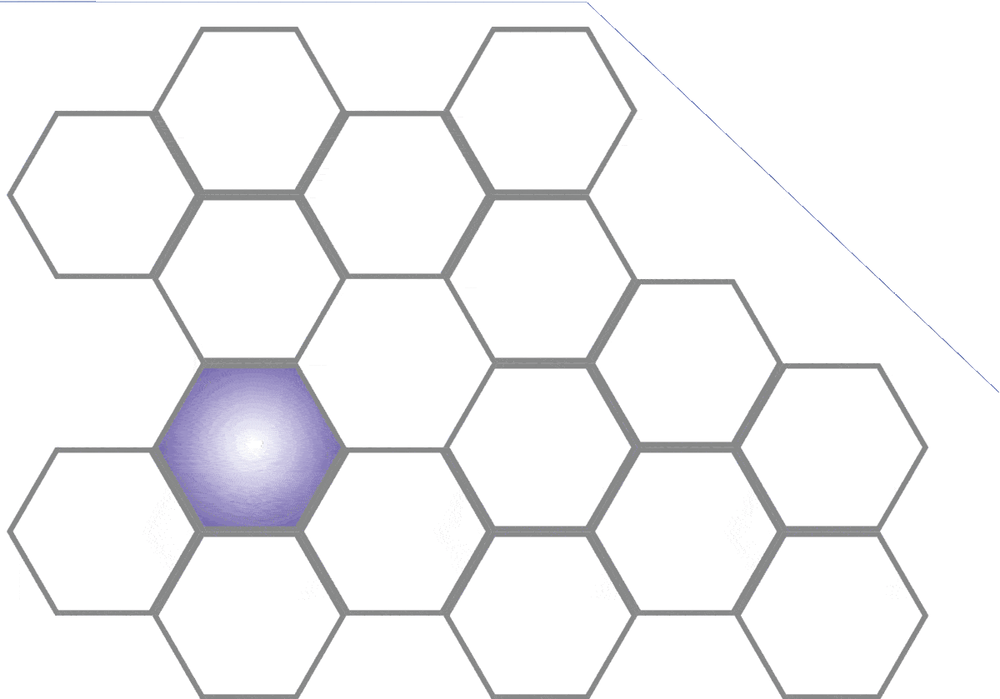
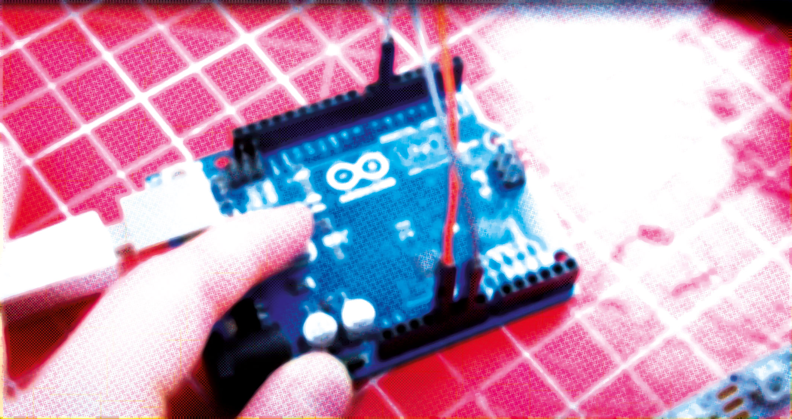
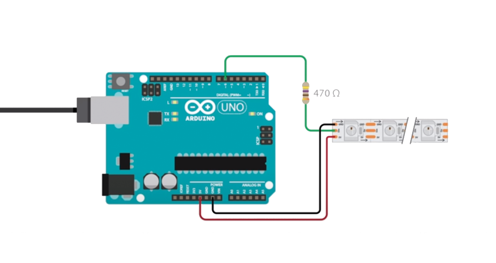

# CABINET

This project is still a work in progress, the current code is tested with 5m of LED strip. See the todo list at the bottom. I started off with this [basic tutorial from KamuiCosplay](https://www.youtube.com/watch?v=EvRxQbhDxCo).

## Hexagons

This cabinet consists of 16 hexagons with sides of 320mm and a depth of 320mm, made of 18mm plywood.

## Arduino

### Getting started
* Download the IDE from [the Arduino website](https://arduino.cc) and install.
* Go to *Sketch -> Include Library -> Manage Libraries* and search for 'neopixel'.
* Install [Adafruit NeoPixel library](https://github.com/adafruit/Adafruit_NeoPixel).
* Go to *Tools -> Board* and select 'Arduino Uno'.
* Go to *Tools -> Programmer* and select 'Arduino as ISP'.
* The port probably is already selected.

I have Arduino 1.8.19 installed, above terms may vary depending on your version.

My program is based on the strandtest included in this library: Open *File -> Examples -> Adafruit NeoPixel -> strandtest*
The original source is also included in this repository.

Below are some comments that were included in that file:

### Neopixel best practices
* Add 1000 uF CAPACITOR between NeoPixel strip's + and - connections.
* Minimize wiring length between microcontroller board and first pixel.
* NeoPixel strip's DATA-IN should pass through a 300-500 Ω RESISTOR.
* Avoid connecting NeoPixels on a live circuit. If you must, **always** connect GROUND (-) first, then +, then data.

A [Dutch manual](https://www.esdsite.nl/elektronica/kleurcode.html) to calculate the resistance based on the color coding.

For a polarized electrolytic capacitor as seen here, the negative (–) lead is usually indicated by a stripe and/or may be shorter than the + lead.
Draw schemes like this with [Fritzing](https://fritzing.org/download/).

Another useful source is the [Adafruit NeoPixel Überguide](https://learn.adafruit.com/adafruit-neopixel-uberguide).

### How many NeoPixels are attached to the Arduino?
`LED_COUNT` is defined by 16 hexagons times 108 LEDs, considering 60 LEDs/meter, that would mean a total of **1728** LEDs.

### Declare our NeoPixel strip object
* Argument 1 = Number of pixels in NeoPixel strip
* Argument 2 = Arduino pin number (most are valid)
* Argument 3 = Pixel type flags, add together as needed: **NEO_KHZ800** 800 KHz bitstream (most NeoPixel products w/WS2812 LEDs)

### Setup function runs once at startup
It is required to include `strip.begin();` in this setup function. This can be used to turn all LEDs of initially and set a brightness. Other functions related to the strip can be found in the [class reference](https://adafruit.github.io/Adafruit_NeoPixel/html/class_adafruit___neo_pixel.html).

### Loop function runs repeatedly
In this function the animation functions can be called. The default ones included in the strandtest are `colorWipe()`, `theaterChase()`, `rainbow()` and `theaterChaseRainbow()`, you can find the documentation of these functions in the original strandtest.ino file. I added my own functions to it: `FX_hexCircle()`, `FXcolorWipeMulti()`

### Remote
The light effects can be selected with a remote control, having a numpad and 4 arrows. However, I might be using the remote of my Dolby receiver, which has an unused numpad. Maybe I'll be able to use the arrow buttons on that too. You may find some useful instructions in this [Youtube video](https://www.youtube.com/watch?v=kZ1HZ6775Mg).

The plan is to program each of those numbers with its own effect. 
Example:
1. Each hexagon is turning on one by one
2. Each hexagon starts circling around
3. Everything is quite dim, but with a motion sensor a single hexagon can light up if I come close
4. Equalizer
5. Circle around 6 hexagons
6. Light up certain hexagons (use arrows to pick which)
7. All off, except when approached
8. Ableton with Max4Live control
9. TBD
10. ...

### Proximity sensors
Each hexagon contains a proximity sensor which can be used to light up a hexagon when something is grabbed from it. Because 16 of those sensors are needed, unfortunately an Arduino Uno won't be sufficient, as it is impossible to connect that many things. That's why I included an Arduino Mega in the shopping list. This also gives me some extra memory capacity. The differences are visible in the table below:

|                           | Arduino Micro  | Arduino Uno    | Arduino Mega   |
|---------------------------|----------------|----------------|----------------|
| Price                     |        € 19,00 |         €20,50 |         €35,00 |
| Dimension                 | 45 * 18 mm     | 68.6 * 53.4 mm | 101.5 * 53.3 mm |
| Processor                 | ATMega328P     | ATMega32U4     | ATMega2560     |
| Clock Speed               |         16 MHz |         16 MHz |         16 MHz |
| Flash Memory              |          32 kB |          32 kB |         256 kB |
| EEPROM                    |           1 kB |           1 kB |           4 kB |
| SRAM                      |         2.5 kB |           2 kB |           8 kB |
| Voltage Level             |             5V |             5V |             5V |
| Digital I/O Pins          |             20 |             14 |             54 |
| Digital I/O with PWM Pins |              7 |              6 |             15 |
| Analog Pins               |             12 |              6 |             12 |
| USB Connectivity          | Micro USB      | USB-A          | USB-A          |
| Shield Compatibility      | No             | Yes            | Yes            |

### Smartphone
Using [RemoteXY](https://remotexy.com) you can create an app for your smartphone. However, I don't think I'll be using this as it requires too much steps to open the app and control my lights. Watch this [Youtube video](https://www.youtube.com/watch?v=2cjufbgOBYo) for further instructions on that. I put a WiFi receiver in the shopping list regardless.

### Ableton
For Ableton Live there is a Max4Live plugin to control the Arduino, I'm not sure how to set that up yet and some additional hardware might be needed. So this part will remain on the wish list until further notice.

## Shopping list

### Cabinet

| Qty | Product | Price |
|---:|----------------|---:|
| 12x | [Plywood Powerplex Pure interior 2440 x 1220 x 18 mm](https://www.hornbach.nl/shop/Multiplexplaat-Powerplex-Pure-interieur-2440-x-1220-x-18-mm/8492345/artikel.html) Assuming each slab contains 8 of the 96 320x320x18mm sections | € 57,95 |
| 1x | [Wood glue](https://www.hornbach.nl/shop/BISON-Houtlijm-750-gr/4138994/artikel.html) | € 9,39 |
| 8x | [Edge Banding 5000x20mm](https://www.hornbach.nl/shop/MACLEAN-Kantenband-naturel-eiken-20-x-5000-mm-voorgelijmd/7879774/artikel.html) | € 3,50 |
| 26x | connectors? | |
| 1x | [Wood finish](https://www.hornbach.nl/shop/GILDE-MEESTERS-Acryl-PU-lak-zijdeglans-blank-1-l/6240064/artikel.html) | € 31,29 |
| | Totals: | € 358,43 |

### Electronics

| Qty | Product | Price |
|---:|----------------|---:|
| 1x | [Arduino Mega 2560 R3](https://www.tinytronics.nl/shop/en/development-boards/microcontroller-boards/arduino-compatible/arduino-mega-2560-r3) | € 35,00 |
| 2x | [DuPont Jumper wire Male-Female 20cm 10 wires](https://www.tinytronics.nl/shop/en/cables-and-connectors/cables-and-adapters/prototyping-wires/dupont-compatible-and-jumper/dupont-jumper-wire-male-female-20cm-10-wires) | € 0,75 |
| 1x | [1000uF 25V Elektrolytic Capacitor](https://www.tinytronics.nl/shop/nl/componenten/condensatoren/1000uf-16v-elektrolytische-condensator) | € 0,25 |
| 6x | [WS2812B Digital 5050 RGB LED Strip - 300 LEDs 5m](https://www.tinytronics.nl/shop/nl/verlichting/led-strips/led-strips/ws2812b-digitale-5050-rgb-led-strip-300-leds-5m) | € 50,00 |
| 1x | [Heat shrink tubing 2:1 - Ø 14mm diameter - 50cm](https://www.tinytronics.nl/shop/nl/gereedschap-en-montage/installatie-en-montagemateriaal/krimpkousen/krimpkous-2:1-%C3%B8-14mm-diameter-50cm) | € 1,15 |
| 1x | [470Ω resistor](https://www.tinytronics.nl/shop/nl/componenten/weerstanden/weerstanden/470%CF%89-weerstand) | € 0,05 |
| 2x | [Mean Well Power Supply - 5V 26A - Switching Power Supply - RS-150-5](https://www.tinytronics.nl/shop/nl/power/voedingen/5v/mean-well-voeding-5v-26a-switching-power-supply-rs-150-5) | € 30,00 |
| 2x | [Standard 230V Power supply cable - 1.8m - Angled plug](https://www.tinytronics.nl/shop/nl/kabels-en-connectoren/kabels-en-adapters/netspanning/voedingskabels/standaard-230v-voedingskabel-1.8m-haakse-stekker) | € 4,00 |
| 1x | [Heat shrink tubing Kit - Black](https://www.tinytronics.nl/shop/nl/gereedschap-en-montage/installatie-en-montagemateriaal/krimpkousen/krimpkous-kit-zwart) | € 4,00 |
| 1x | [Budget Soldering Station Kit - ZD-99 - 48W](https://www.tinytronics.nl/shop/nl/gereedschap-en-montage/solderen/soldeerbouten-en-stations/budget-soldeerstation-kit-zd-99-48w) | € 25,00 |
| 1x | [Rotary Encoder Module](https://www.tinytronics.nl/shop/nl/schakelaars/manuele-schakelaars/rotary-encoders/rotary-encoder-module) | € 1,50 |
| 1x | [IR sensor module with remote and battery - With IR LED](https://www.tinytronics.nl/shop/nl/communicatie-en-signalen/draadloos/infrarood/ir-sensor-module-met-afstandsbediening-en-batterij-met-ir-led) | € 3,00 |
| 16x | [Object Detection Sensor Module](https://www.tinytronics.nl/shop/nl/sensoren/optisch/infrarood/object-detectie-sensor-module) | € 2,00 |
| 1x | [Breadboard 170 points - Black](https://www.tinytronics.nl/shop/en/tools-and-mounting/prototyping-supplies/breadboards/breadboard-170-points-black) | € 1,50 |
| 20x | [JST-SM 3p Compatible Extension Cable - 100cm](https://www.tinytronics.nl/shop/en/lighting/led-strips/accessories/jst-sm-3p-compatible-extension-cable-100cm) | € 2,50 |
| 1x | [ESP8266 WiFi Module ESP-01 1MB](https://www.tinytronics.nl/shop/en/communication-and-signals/wireless/wi-fi/modules/esp8266-wifi-module-esp-01-1mb) | € 5,00 |
| | Totals: | € 528,95 |

## Other Arduino projects

[Reddit: /r/arduino](https://www.reddit.com/r/arduino/)

## TODO

* Build the cabinet, cut up the LED strip in 16 pieces holding 108 LEDs each.
* Connect all to the Arduino and the power supply - determine how many power supplies are needed.
* Include programming for the IR-sensor and the remote
* Include programming for the object detection
