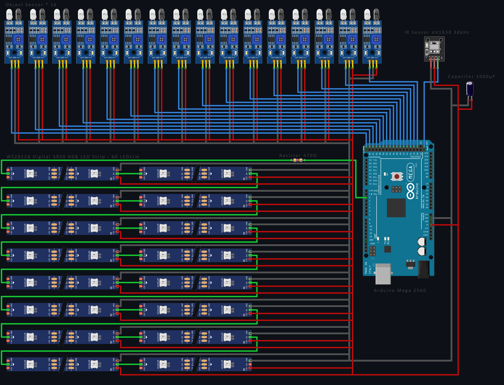

# CABINET

## Hexagons

This cabinet consists of 16 hexagons with sides of 320mm and a depth of 320mm.

## Arduino

### Getting started
* Download the IDE from [the Arduino website](https://arduino.cc) and install.
* Go to *Sketch -> Include Library -> Manage Libraries* and search for 'neopixel'.
* Install [Adafruit NeoPixel library](https://github.com/adafruit/Adafruit_NeoPixel).
* Go to *Tools -> Board* and select 'Arduino Uno'.
* Go to *Tools -> Programmer* and select 'Arduino as ISP'.
* The port probably is already selected.

I have Arduino 1.8.19 installed, above terms may vary depending on your version.

My program is based on the strandtest included in this library: Open *File -> Examples -> Adafruit NeoPixel -> strandtest*
The original source is also included in this repository.

Below are some comments that were included in that file:

### Neopixel best practices
* Add 1000 uF CAPACITOR between NeoPixel strip's + and - connections.
* Minimize wiring length between microcontroller board and first pixel.
* NeoPixel strip's DATA-IN should pass through a 300-500 OHM RESISTOR.
* AVOID connecting NeoPixels on a LIVE CIRCUIT. If you must, ALWAYS connect GROUND (-) first, then +, then data.
* When using a 3.3V microcontroller with a 5V-powered NeoPixel strip, a LOGIC-LEVEL CONVERTER on the data line is STRONGLY RECOMMENDED. (Skipping these may work OK on your workbench but can fail in the field)

### How many NeoPixels are attached to the Arduino?
LED_COUNT is defined by 20 hexagons times 108 LEDs, considering 60 LEDs/meter.

### Declare our NeoPixel strip object
* Argument 1 = Number of pixels in NeoPixel strip
* Argument 2 = Arduino pin number (most are valid)
* Argument 3 = Pixel type flags, add together as needed:
  * NEO_KHZ800  800 KHz bitstream (most NeoPixel products w/WS2812 LEDs)
  * NEO_KHZ400  400 KHz (classic 'v1' (not v2) FLORA pixels, WS2811 drivers)
  * NEO_GRB     Pixels are wired for GRB bitstream (most NeoPixel products)
  * NEO_RGB     Pixels are wired for RGB bitstream (v1 FLORA pixels, not v2)
  * NEO_RGBW    Pixels are wired for RGBW bitstream (NeoPixel RGBW products)

### Setup function runs once at startup
It is required to include `strip.begin();` in this setup function. This can be used to turn all LEDs of initially and set a brightness.

### Loop function runs repeatedly
In this function the animation functions can be called. The default ones included in the strandtest are `colorWipe()`, `theaterChase()`, `rainbow()` and `theaterChaseRainbow()`, you can find the documentation of these functions in the original strandtest.ino file. I added my own functions to it: `hexCircle()`, `colorWipeMulti()`

## References

* [Basic tutorial from KamuiCosplay](https://www.youtube.com/watch?v=EvRxQbhDxCo)
* [Adafruit NeoPixel Überguide](https://learn.adafruit.com/adafruit-neopixel-uberguide)
* [Controlling with remote](https://www.youtube.com/watch?v=kZ1HZ6775Mg)

## Shopping list

* 1x [DuPont Jumper draad Male-Female 20cm 10 draden](https://www.tinytronics.nl/shop/nl/kabels-en-connectoren/kabels-en-adapters/prototyping-draden/dupont-compatible-en-jumper/dupont-jumper-draad-male-female-20cm-10-draden) € 0,75
* 1x [DuPont Jumper draad Male-Male 20cm 10 draden](https://www.tinytronics.nl/shop/nl/kabels-en-connectoren/kabels-en-adapters/prototyping-draden/dupont-compatible-en-jumper/dupont-jumper-draad-male-male-20cm-10-draden) € 0,75
* 1x [1000uF 25V Elektrolytische Condensator](https://www.tinytronics.nl/shop/nl/componenten/condensatoren/1000uf-16v-elektrolytische-condensator) € 0,25
* 6x [WS2812B Digitale 5050 RGB LED Strip - 300 LEDs 5m](https://www.tinytronics.nl/shop/nl/verlichting/led-strips/led-strips/ws2812b-digitale-5050-rgb-led-strip-300-leds-5m) € 50,00
* 1x [Krimpkous 2:1 - Ø 14mm diameter - 50cm](https://www.tinytronics.nl/shop/nl/gereedschap-en-montage/installatie-en-montagemateriaal/krimpkousen/krimpkous-2:1-%C3%B8-14mm-diameter-50cm) € 1,15
* 1x [470Ω weerstand](https://www.tinytronics.nl/shop/nl/componenten/weerstanden/weerstanden/470%CF%89-weerstand) € 0,05
* 3x [Mean Well Voeding - 5V 26A - Switching Power Supply - RS-150-5](https://www.tinytronics.nl/shop/nl/power/voedingen/5v/mean-well-voeding-5v-26a-switching-power-supply-rs-150-5) € 30,00
* 1x [Standaard 230V Voedingskabel - 1.8m - Haakse stekker](https://www.tinytronics.nl/shop/nl/kabels-en-connectoren/kabels-en-adapters/netspanning/voedingskabels/standaard-230v-voedingskabel-1.8m-haakse-stekker) € 4,00
* 1x [Krimpkous Kit - Zwart](https://www.tinytronics.nl/shop/nl/gereedschap-en-montage/installatie-en-montagemateriaal/krimpkousen/krimpkous-kit-zwart) € 4,00
* 1x [Budget Soldeerstation Kit - ZD-99 - 48W](https://www.tinytronics.nl/shop/nl/gereedschap-en-montage/solderen/soldeerbouten-en-stations/budget-soldeerstation-kit-zd-99-48w) € 25,00
* 1x [Rotary Encoder Module](https://www.tinytronics.nl/shop/nl/schakelaars/manuele-schakelaars/rotary-encoders/rotary-encoder-module) € 1,50

Totals: € 427,45

## Other Arduino projects

[Reddit: /r/arduino](https://www.reddit.com/r/arduino/)